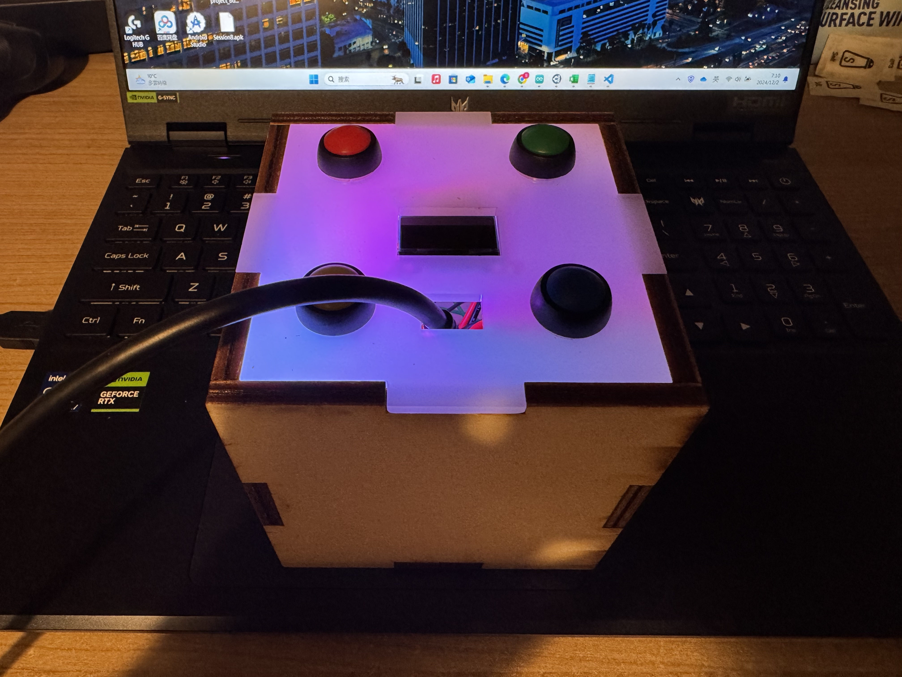
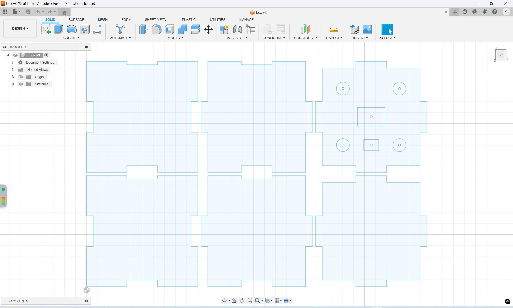

# CASA0014_Connected-Environments_Chrono_Lumina: The Cube
<p align="center">
  
</p>

## Table of Contents

1. [The Cube](#the-cube)
2. [Background](#background)
3. [Key Components](#key-components)
4. [Model Design](#model-design)
5. [Model Schematic and Circuit](#model-schematic-and-circuit)
6. [Step by Step Promotion and Main Functional Code](#Step-by-Step-Promotion-and-Main-Functional-Code)

## The Cube📦
The Cube is a desktop multifunctional controller designed for professional users. It can automatically set learning and working times by placing its different faces on the table, and emit different lights to prompt users how much time to set for this learning period and the remaining time. At the same time, by operating its different buttons, users can map different matrix data in the environment to the Chrono Lumina light curtain, such as the temperature of each individual in the server unit and the gain of different WiFi signals in the environment.

## Background
#### Time Management and Focus
The Pomodoro Technique is a simple and efficient time management method invented by Italian Francesco Cirillo in the 1980s. The core idea of this method is to help people improve their focus and productivity while avoiding fatigue by dividing work time into focused work periods and brief rest periods.

#### The Value of Environmental Data Visualization
Environmental data is generally abstract, especially when it comes to electrical and hardware data in the environment. Users have a strong demand for monitoring these data, but these data are generally difficult to control, especially in terms of visualization. Users usually need to seek different types of dashboards to detect changes in the data. However, using dashboards for data visualization is still not intuitive enough. So, visually inspecting the target data and even mapping it onto a carrier that can provide an intuitive visual experience has become a new choice.

**Reference:**

[1] Pomodoro Technique - [Wikipedia](https://en.wikipedia.org/wiki/Pomodoro_Technique)  
[2] 11 Great Environmental Visualizations on the Internet (2019) - [Keen.io](https://keen.io/blog/11-great-environmental-visualizations-on-the-internet-2019/)  


## Key Components

- **Arduino MKR WiFi 1010**
  - Microcontroller:	SAMD21 Cortex-M0+ 32-bit low-power ARM MCU
  - Wireless Module	ESP32: (Wi-Fi 802.11 b/g/n and BLE)
  - Digital I/O Pins:	8 (3 PWM outputs)
  - Analog Input Pins:	7 (12-bit ADC)
  - Analog Output Pins:	1 (DAC)
  - Operating Voltage:	3.3V (I/O pins are not 5V tolerant)
  - Input Voltage:	7-12V (via VIN pin)
  - Power Interfaces:	USB or battery (Li-Po, max 1A charging)
  - Clock Speed:	48 MHz
  - Memory:	256 KB Flash, 32 KB SRAM
  - Peripheral Interfaces:	UART, SPI, I2C
  - Onboard Security: Chip	ECC508 (for encryption and authentication)
  - Dimensions:	61.5 mm x 25 mm x 1.2 mm
  - Weight:	32 g
  [Arduino MKR WiFi 1010 Datasheet](https://docs.arduino.cc/hardware/mkr-wifi-1010)

- **MPU-6050 MPU6050 6-axis Accelerometer Gyroscope Sensor**
  - Sensor Type	MEMS 6-axis: (3-axis accelerometer + 3-axis gyroscope)
  - Accelerometer Range:	±2g, ±4g, ±8g, ±16g (configurable)
  - Gyroscope Range:	±250, ±500, ±1000, ±2000°/s (configurable)
  - Operating Voltage:	2.375V – 3.46V
  - Interface	I2C: (supports 100kHz or 400kHz)
  - Power Consumption:	Typical 500μA (normal mode), 8μA (sleep mode)
  - Resolution:	16-bit output resolution
  - Output Data Rate (ODR):	4 Hz – 1 kHz
  - FIFO Buffer	1024 bytes:
  - Built-in Temperature Sensor:	-40°C to +85°C (±1°C accuracy)
  - Package Dimensions:	4x4x0.9 mm 
  [MPU6050 Datasheet](https://developer.nordicsemi.com/nRF_Connect_SDK/doc/v1.6-branch/zephyr/samples/sensor/mpu6050/README.html?utm_feeditemid=&utm_device=c&utm_term=&utm_source=google&utm_medium=ppc&utm_campaign=nRF54L15+-+Pmax&hsa_cam=21932362775&hsa_grp=&hsa_mt=&hsa_src=x&hsa_ad=&hsa_acc=1116845495&hsa_net=adwords&hsa_kw=&hsa_tgt=&hsa_ver=3&gad_source=1&gclid=Cj0KCQiAr7C6BhDRARIsAOUKifi6qiTKGJfQ0gwFQNdYTBpYdgyb0GT3oNEpxJ8-p5_Okr-zF4hEF08aAms5EALw_wcB)

- **NeoPixel Stick 8**
  - LED Count:	8 individually addressable RGB LEDs
  - LED Type:	WS2812B (integrated RGB LEDs with built-in drivers)
  - Operating Voltage:	5V DC
  - Communication Protocol:	One-wire digital communication
  - Current Consumption:	~20mA per LED at full brightness (all colors on, white)
  - Control Interface:	Data-in, Data-out (chainable for multiple sticks)
  - Colors:	24-bit color (8-bit each for red, green, blue)
  - Dimensions:	~100 mm x 12.5 mm x 2 mm
  - Weight:	~4 g
  - PWM Refresh Rate:	~400 Hz
  - Viewing Angle:	~120 degrees
  - Operating Temperature:	-40°C to +85°C
  [NeoPixel Stick 8 Datasheet](https://www.adafruit.com/product/1426)


## Model Design

<p align="center">
  
</p>

<p align="center"><b>Pic.1:</b> Static mode: No timing at this time.</p>

<p align="center">
  
</p>

<p align="center"><b>Pic.2:</b> Four timing modes: Flip to different faces to determine different times, and the box cover reflects different colors</p>


## Model Schematic and Circuit

<p align="center">
  
</p>

<p align="center"><b>Pic.3:</b> Model Schematic (Shell) </p>

<p align="center">
  
</p>

<p align="center"><b>Pic.4:</b> Prototype Circuit </p>


## Step by Step Promotion and Main Functional Code

### 1. Network
  #### 1.1. Wifi Setup

```C++
void startWifi(){ 
  // check for the WiFi module:
  if (WiFi.status() == WL_NO_MODULE) {
    Serial.println("Communication with WiFi module failed!");
    // don't continue
    while (true);
  }
  String fv = WiFi.firmwareVersion();
  if (fv < WIFI_FIRMWARE_LATEST_VERSION) {
    Serial.println("Please upgrade the firmware");
  }

  // Function for connecting to a WiFi network
  // is looking for UCL_IoT and a back up network (usually a home one!)
  int n = WiFi.scanNetworks();
  Serial.println("Scan done");
  if (n == 0) {
    Serial.println("no networks found");
  } else {
    Serial.print(n);
    Serial.println(" networks found");
    // loop through all the networks and if you find UCL_IoT or the backup - ssid1
    // then connect to wifi
    Serial.print("Trying to connect to: ");
    Serial.println(ssid);
    for (int i = 0; i < n; ++i){
      String availablessid = WiFi.SSID(i);
      // Primary network
      if (availablessid.equals(ssid)) {
        Serial.print("Connecting to ");
        Serial.println(ssid);
        WiFi.begin(ssid, password);
        while (WiFi.status() != WL_CONNECTED) {
          delay(600);
          Serial.print(".");
        }
        if (WiFi.status() == WL_CONNECTED) {
          Serial.println("Connected to " + String(ssid));
          break; // Exit the loop if connected
        } else {
          Serial.println("Failed to connect to " + String(ssid));
        }
      } else {
        Serial.print(availablessid);
        Serial.println(" - this network is not in my list");
      }
    }
  }
  Serial.println("");
  Serial.println("WiFi connected");
  Serial.print("IP address: ");
  Serial.println(WiFi.localIP());
}
```

#### 2.1. MQTT Connection Setup
```cpp
  void reconnectMQTT() {
  if (WiFi.status() != WL_CONNECTED){
    startWifi();
  } else {
    //Serial.println(WiFi.localIP());
  }
  // Loop until we're reconnected
  while (!client.connected()) {    // while not (!) connected....
    Serial.print("Attempting MQTT connection...");
    // Create a random client ID
    String clientId = "LuminaSelector";
    clientId += String(random(0xffff), HEX);
    
    // Attempt to connect
    if (client.connect(clientId.c_str(), mqtt_username, mqtt_password)) {
      Serial.println("connected");
      // ... and subscribe to messages on broker
    } else {
      Serial.print("failed, rc=");
      Serial.print(client.state());
      Serial.println(" try again in 5 seconds");
      // Wait 5 seconds before retrying
      delay(5000);
    }
  }
}
  ```

### 2. Chrono Lumina Color Changing
  #### 2.1. Color Changing on Single Light
  ```cpp
  void sendsinglepxmqtt(){
  // send a message to update the light
  char mqtt_message[100];
  if (lightsatus != Colors.clrstatus)
  {
    for(int i = 0; i < 12; i++){
      sprintf(mqtt_message, "{\"pixelid\": %d, \"R\": %d, \"G\": %d, \"B\": %d, \"W\": 0}", i, Colors.Red, Colors.Green, Colors.Blue);
      Serial.println(mqtt_topic_demo);
      Serial.println(mqtt_message);
      if (client.publish(mqtt_topic_demo, mqtt_message)) {
        Serial.println("Message published");
      } else {
        Serial.println("Failed to publish message");
      }
    }
    pixels.clear();
    for(int i=0; i<NUMPIXELS; i++) {
      pixels.setPixelColor(i, Colors.Red, Colors.Green, Colors.Blue);
      pixels.show();
    }
    lightsatus = Colors.clrstatus;
  }
}
  ```

  #### 2.2. Color Changing on All Lights
  ```cpp
void sendgroupmqtt(){
  // send a message to update the light
  char mqtt_message[100];
  char mqtt_topic_gothrough[] = "student/CASA0014/light/1/pixel/";
  
  if (lightsatus != Colors.clrstatus)
  {
    for(int j = 1; j < 53; j++){
      sprintf(mqtt_topic_gothrough, "student/CASA0014/light/%d/pixel/",j);
      for(int i = 0; i < 12; i++){
        sprintf(mqtt_message, "{\"pixelid\": %d, \"R\": %d, \"G\": %d, \"B\": %d, \"W\": 0}", i, Colors.Red, Colors.Green, Colors.Blue);
        Serial.println(mqtt_topic_gothrough);
        Serial.println(mqtt_message);
        if (client.publish(mqtt_topic_gothrough, mqtt_message)) {
          Serial.println("Message published");
        } else {
          Serial.println("Failed to publish message");
        }
      }
      pixels.clear();
      for(int i=0; i<NUMPIXELS; i++) {
        pixels.setPixelColor(i, Colors.Red, Colors.Green, Colors.Blue);
        pixels.show();
      }
      lightsatus = Colors.clrstatus;
    }
  }
}
  ```

  #### 2.3. Reset All Lights
  ```cpp
  void resetLight(){
  char mqtt_message[100];
  char mqtt_topic_gothrough[] = "student/CASA0014/light/1/pixel/";
  for(int j = 1; j < 53; j++){
      sprintf(mqtt_topic_gothrough, "student/CASA0014/light/%d/all/",j);
      for(int i = 0; i < 12; i++){
        sprintf(mqtt_message, "{\"method\": \"clear\"}");
        Serial.println(mqtt_topic_gothrough);
        Serial.println(mqtt_message);

        if (client.publish(mqtt_topic_gothrough, mqtt_message)) {
          Serial.println("Message published");
        } else {
          Serial.println("Failed to publish message");
        }
      }
  }
}
```

### 3. Button Control & Modes Switching
```cpp
void buttonpress() {
  // Read button states
  bool button1State = digitalRead(button1Pin) == LOW;
  bool button2State = digitalRead(button2Pin) == LOW;
  bool button3State = digitalRead(button3Pin) == LOW;
  bool button4State = digitalRead(button4Pin) == LOW;

  // Detect button 1's state change (from not pressed to pressed)
  if (button1State && !lastButton1State) {
    if (button1Count == 0){
      button1Count++;
    } else if (button1Count == 1){
      button1Count = 0;
    }
  }

  // Detect button 2's state change
  if (button2State && !lastButton2State) {
    button2Count++;
    resetLight();
  }

  // Detect button 3's state change
  if (button3State && !lastButton3State) {
    button3Count++;
  }

  // Detect button 4's state change
  if (button4State && !lastButton4State) {
    button4Count++;
  }

  // Update the last button state
  lastButton1State = button1State;
  lastButton2State = button2State;
  lastButton3State = button3State;
  lastButton4State = button4State;

  if (button1Count == 0){
    sendsinglepxmqtt();
  } else if (button1Count == 1){
    sendgroupmqtt();
  }

  // Print button state and count to the serial monitor
  Serial.print("Button 1: ");
  Serial.print(button1State ? "Pressed" : "Released");
  Serial.print(" (Count: ");
  Serial.print(button1Count);
  Serial.print(") | Button 2: ");
  Serial.print(button2State ? "Pressed" : "Released");
  Serial.print(" (Count: ");
  Serial.print(button2Count);
  Serial.print(") | Button 3: ");
  Serial.print(button3State ? "Pressed" : "Released");
  Serial.print(" (Count: ");
  Serial.print(button3Count);
  Serial.print(") | Button 4: ");
  Serial.print(button4State ? "Pressed" : "Released");
  Serial.print(" (Count: ");
  Serial.print(button4Count);
  Serial.println(")");
}
  ```

### 4. Monitor Temperature Changes within piCloud

### 5. Monitor the WiFi Signal Gain of Different SSIDs in the Monitoring Environment
